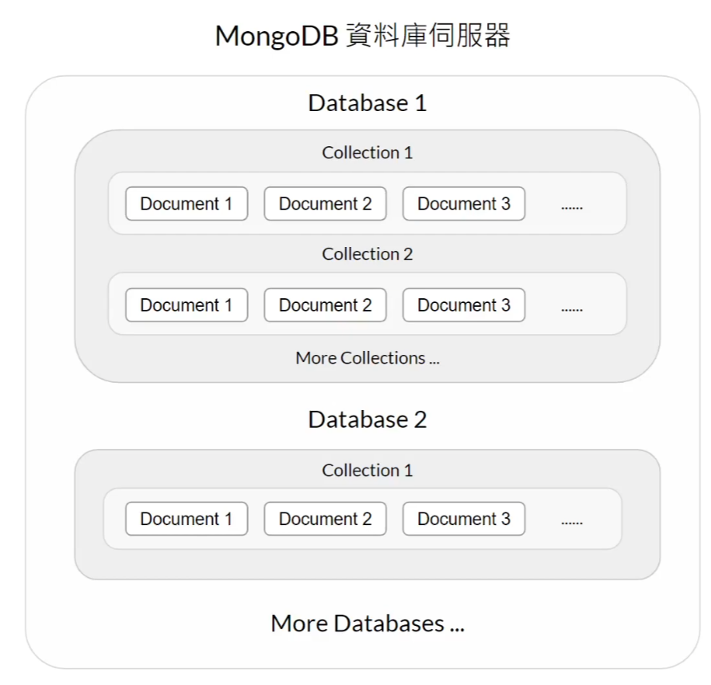

**MongoDB 儲存資料的方式**

三層式的結構

．資料庫　Database

．集合   Collection

．文件   Document





MongoDB.com 


``` python
collection.insert_one({})

collection.insert_many([{,}])

collection.find_one(Objected()) # must from bson.objectid import ObjectId

collection.find()              # must all data have common key
for doc in find_all:
	print(doc[''])

collection.update_one({},{"$set":{}})

collection.update_many({},{"$set":{}})

collection.update_one({},{"$unset":{}})

collection.update_one({},{"$inc":{}})

collection.update_one({},{"$mul":{}})

print("Meet the criteria count",var.matched_count)
print("Actual modification count",var.modified_count)

```